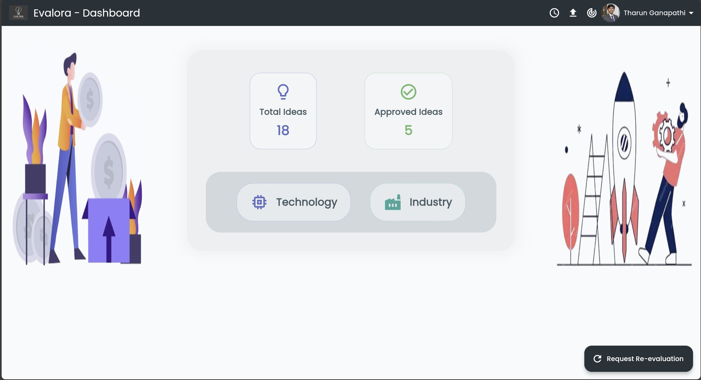
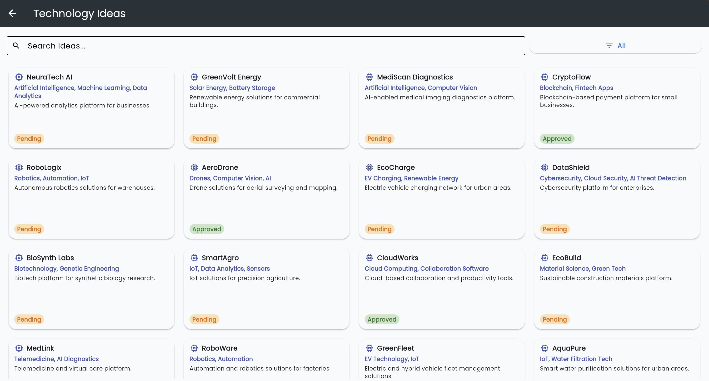
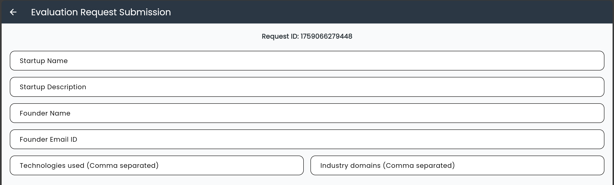
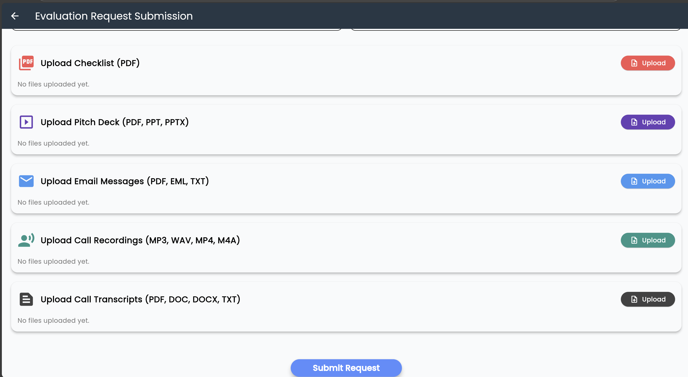

<p align="center">
  
</p>

# Evalora - Investor Evaluation Platform

[](https://flutter.dev/)
[](LICENSE)

---

## Project Overview

**Evalora** is a Flutter-based frontend application designed to help investors evaluate startups efficiently.  
The app provides a streamlined interface for scoring, reviewing, and tracking startup profiles, making investment decisions **data-driven, transparent, and fast**.

---

## Key Features

- **Browse & Search**: Explore startup profiles with filtering and search capabilities.  
- **Evaluation & Scoring**: Rate startups using customizable scoring criteria.  
- **Analytics & History**: View detailed analytics, evaluation history, and trends.  
- **Secure & Responsive**: User authentication, secure data storage, and a responsive UI for mobile and web.  

---

## Installation

1. Ensure [Flutter](https://docs.flutter.dev/get-started/install) is installed on your machine.  
2. Clone the repository:
    ```bash
    git clone <repository-url>
    cd client
    ```
3. Install dependencies:
    ```bash
    flutter pub get
    ```
4. Run the app:
    ```bash
    flutter run
    ```
5. For web support:
    ```bash
    flutter run -d chrome
    ```

---

## Folder Structure

```text
client/
├─ lib/          # Main application code
├─ assets/       # Images, fonts, and other static assets
├─ test/         # Unit and widget tests
├─ pubspec.yaml  # Flutter project configuration
```

---

## Screenshots

<p align="center">

<table>
  <tr>
    <td align="center">
      <br>
      <b>Dashboard Overview</b>
    </td>
    <td align="center">
      <br>
      <b>Sub Dashboard with Filters</b>
    </td>
  </tr>
  <tr>
    <td align="center">
      <br>
      <b>Request Submission - Details</b>
    </td>
    <td align="center">
      <br>
      <b>Request Submission - Document Upload</b>
    </td>
  </tr>
</table>

</p>

---

## Contributing

We welcome contributions to **Evalora**!  

1. Fork the repository  
2. Create a feature branch (e.g., `feature/new-feature`)  
3. Commit your changes  
4. Submit a Pull Request with a clear description of your changes  

---

## License

This project is licensed under the **MIT License**.  
See the [LICENSE](LICENSE) file for details.

---

## Contact

For questions or feedback, reach out to the project maintainers or open an issue in the repository.  

---
