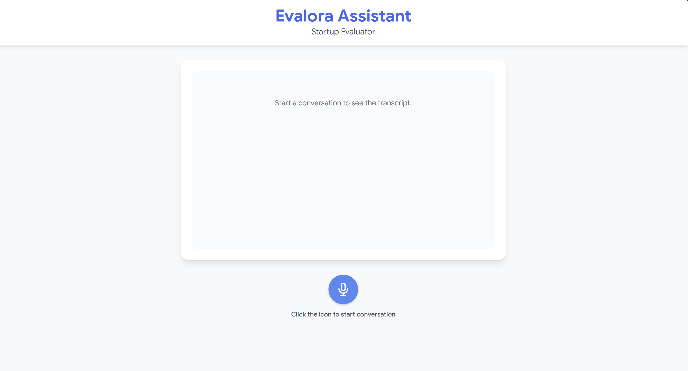

# Evalora Multi-Agent Architecture
<p align="center">
</p>
**Overview**  
The Evalora platform leverages a **multi-agent architecture** to automate and streamline startup evaluation. Each agent is designed with a specialized focus to handle specific domains, ensuring scalable, intelligent, and efficient processing.

---

## Core Agents

| Agent Name              | Responsibility                                      | Status       |
|-------------------------|----------------------------------------------------|-------------|
| **business_agent**       | Oversees core business logic and workflow         | Initial Design |
| **finance_agent**        | Handles financial analysis and evaluation        | Initial Design |
| **investor_agent**       | Manages investor interactions and matching       | Initial Design |
| **market_agent**         | Conducts market research and insights           | Initial Design |
| **personality_agent**    | Assesses founder and team personality traits    | Initial Design |
| **product_agent**        | Evaluates product feasibility and roadmap       | Initial Design |
| **risk_compliance_agent**| Monitors regulatory compliance and risk         | Initial Design |
| **team_agent**           | Analyzes team structure and capabilities        | Initial Design |
| **vision_agent**         | Ensures alignment with startup vision & strategy| Initial Design |

---

## Architecture Highlights

- **Modular Design**: Each agent operates independently, enabling easy updates and scalability.
- **Inter-Agent Communication**: Agents communicate through a secure message bus to share insights.
- **AI-Enhanced Processing**: Core agents leverage AI for intelligent evaluations.
- **Extensible Framework**: New agents can be added without disrupting existing workflows.

---

## UI for voice session with agentic ai
 

## Getting Started

1. Clone the repository:
```bash
git clone <repository-url>
cd ventureSense
```
2. Install dependencies:
```bash
pip install -r requirements.txt
```
3. Run the agent system:
```bash
uvicorn main:app --reload
```

## License

This project is open-sourced under the Apache 2.0 License.

